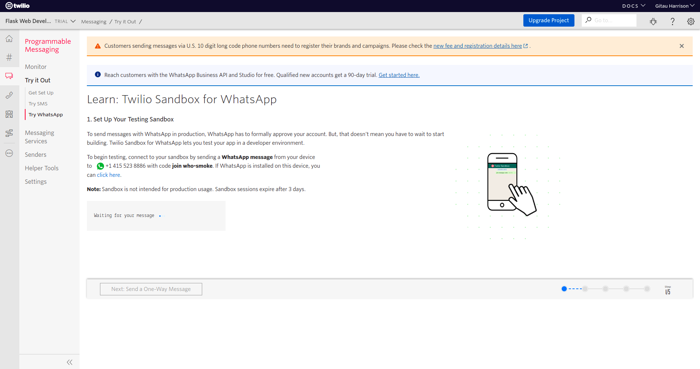
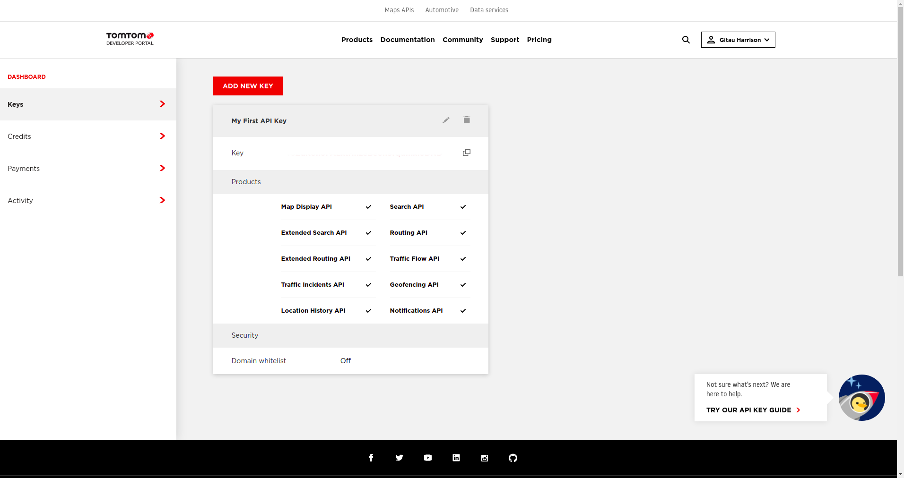
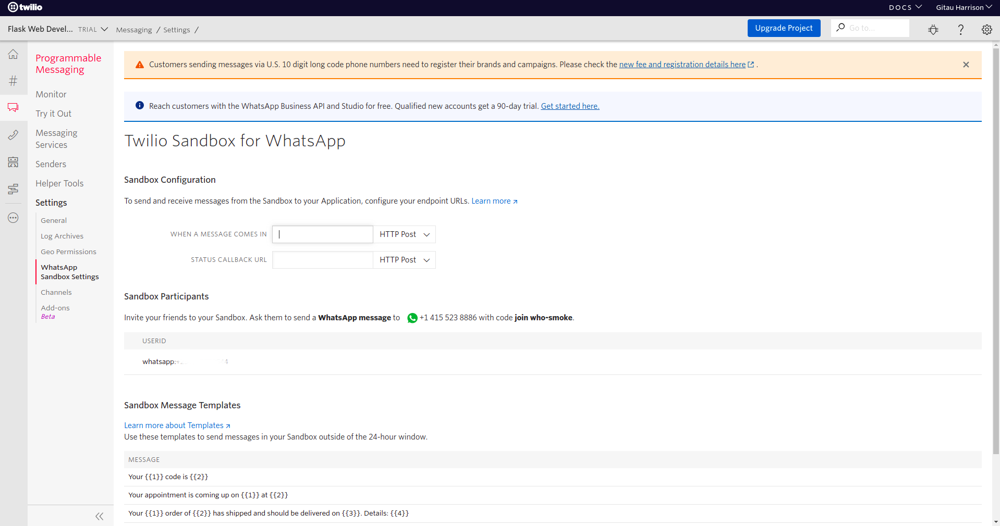

# Live Traffic Chatbot Using WhatsApp


This is a simple chatbot that gives a live update about a user's location. Not only that, it provides a map's link to see where exactly the live update information applies.

## Features
* Appropriate feedback if the chatbot does not understand what the user says
* Live update about traffic
* Link to an interactive map

## Tools
* [TomTom API](https://www.tomtom.com/en_gb/)
* Flask
* Twilio API 
* Pyngrok
* Heroku

## Deployed Application

* [Live Traffic WhatsApp Chatbot](https://live-traffic-whatsapp-chatbot.herokuapp.com/)

## Contributors

* [Gitau Harrison](https://github.com/GitauHarrison)


## Testing This Application Locally

This is a mobile-based chatbot. You cannot find the chatbot on the deployed link. To test it out, you will need these:

* A smartphone
* An active phone number
* WhatsApp mobile application installed in your smartphone
* Twilio Account

Twilio provides a [WhatsApp Sandbox](https://www.twilio.com/console/sms/whatsapp/learn) that allows you to easily develop and test your application. To get started:

* You need to [create a Twilio account](https://www.twilio.com/try-twilio?promo=WNPWrR) now
* From the [Twilio Console](https://www.twilio.com/console), click [Programmable Messaging](https://www.twilio.com/console/sms/dashboard)
* Click _Try It Out_/[Try WhatsApp](https://www.twilio.com/console/sms/whatsapp/learn)



You will see the Sandbox phonenumber assigned to you. There is also a code beginning with `join-` followed by two random words. You will need to send this code as a WhatsApp message to the number assigned to you to enable WhatsApp Sandbox.

* Clone this project:

```python
$ git clone git@github.com:GitauHarrison/live-traffic-whatsapp-chatbot.git
```

* Move into the clone folder:

```python
$ cd live-traffic-whatsapp-chatbot
```

* Activate your virtual environment:

```python
$ mkvirtualenv live_whatsapp_chatbot
```

* Install all project requirements within your activate virtual environment:

```python
(live_whatsapp_chatbot)$ pip3 install -r requirements.txt
```

* Before you can run this application, you will need to create a `.env` file in the top-level directory following the example seen in the `.env-template`:

```python
(live_whatsapp_chatbot)$ touch .env
```

* Create a developer account with from TomTom API [here](https://developer.tomtom.com/user/register). This will grant you 2500 free API calls per day.

* You can create your API Key which you will later see in your dashboard



* Add this key to your `.env` file:

```python
TOMTOM_API_KEY='<your-TomTom_API-Key>'
```

* Run the application:

```python
(live_whatsapp_chatbot)$ flask run
```

You can access your localhost on http://127.0.0.1:5000/ as seen in the terminal. Additionally, if you look carefully in your terminal, you will see `* Tunnel URL: NgrokTunnel: "https://4209c9af6d43.ngrok.io" -> "http://localhost:5000"`. This is the free public URL that `ngrok` has assigned you; giving access to your locally hosted application.

Alternatively, you can open another window in your terminal and run:

```python
(live_whatsapp_chatbot)$ ngrok http 5000
```

Check out on the lines beginning with "Forwarding". You will use the `https://` URL to allow for access to your locally hosted application.

* Go back to your Twilio account and click [Setting](https://www.twilio.com/console/sms/settings)
* Finally, click on [WhatsApp Sandbox Setting](https://www.twilio.com/console/sms/whatsapp/sandbox)



* In the box that says "WHEN A MESSAGE COMES IN", paste that `ngrok` URL. Remember to append `/bot` to your URL because this is the webhook that Twilio needs to know.

* Click the _Save_ button

Go back to your WhatsApp application on your phone. Ensure you have added your Sandbox number to your contact list. Then send a message to it as seen in the gif image at the top of this page.

Alternatively, if you do not want to use the free `ngrok` URL, which keep changing and is short-lived, you can deploy your application to [Heroku](https://www.heroku.com/). Paste your Heroku URL in the "WHEN A MESSAGE COMES IN" box. Test out the application in your WhatsApp.

## Reference

* If you are new to flask, I recommend that you begin from [here](https://gitauharrison-blog.herokuapp.com/personal-blog)
* If you do not know what `virtualenvwrapper` is or you do not know how to use it, [check this guide](https://gitauharrison-blog.herokuapp.com/virtualenvwrapper)
* It you would like to create your own live traffic chatbot, you can learn how to do it [here](https://github.com/GitauHarrison/notes/blob/master/live_traffic_whatsapp_chatbot.md)